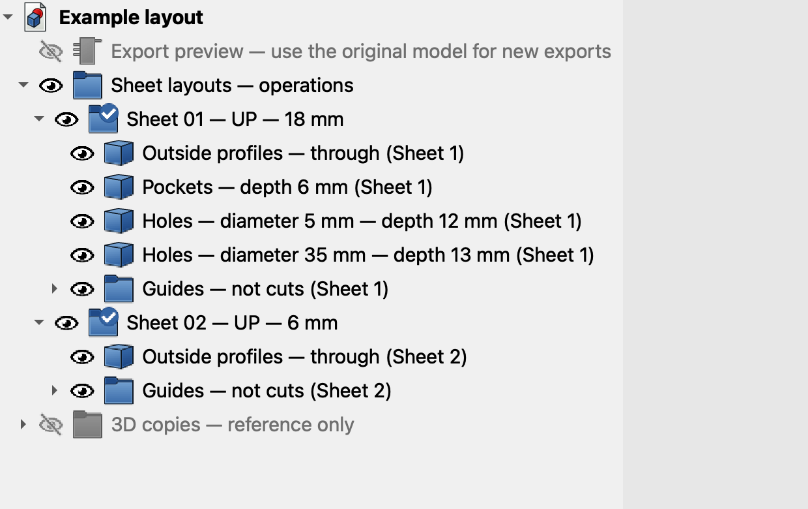

# FreeCAD Lay Flat for CNC

Turn the panels in a FreeCAD model into flat sheet layouts for CNC preparation.

For example, open a cabinet model, choose its sides and shelves, and arrange flat copies on sheets of plywood. The tool measures their thickness, keeps different thicknesses on separate sheets, and exports drawings you can open in your CAM software.

**Your original model stays in place.** The tool exports separate copies; you do not need to dismantle or flatten your assembly by hand.

**[Download version 0.12.11 — complete ZIP](https://github.com/getmora/freecad-lay-flat-for-cnc/releases/download/v0.12.11/FreeCAD-Lay-Flat-for-CNC-0.12.11.zip)** · [Release notes](https://github.com/getmora/freecad-lay-flat-for-cnc/releases/tag/v0.12.11)

## New in 0.12.11

- **Standard DXF now opens in VCarve:** earlier versions wrote DXF files that VCarve Pro refused with *"Syntax error or premature end of file on line/offset 240"* and imported nothing. Standard DXF files now contain the full structure that R2004 readers expect. Geometry, layers and colours are unchanged. **Export again with 0.12.11** to replace older DXF files.
- **Fewer valid parts rejected:** doors and drawer fronts with chamfered capsule pulls, paired pulls on the meeting edge and open-edge notches now export instead of stopping with taper or *BSplineSurface* errors.
- **Exact part sizes:** part sizes and placement use exact bounds, so some flipped parts no longer report oversized dimensions and STEP solids line up with the DXF origin.
- **Stricter checking:** if the machining check cannot rebuild a part reliably, that part is refused instead of passed.

Version 0.12.8 introduced the current workflow: create the sheet layout first, then right-click to export all sheets or one, with DXF, SVG or Mozaik R12 formats.

**Updating from an older version:** use the complete ZIP and installer so the `lay_flat_sheet.py` companion is installed too. It enables the saved layout's right-click export menu.

## What it does

- Lets you choose exactly which solid parts to export, including parts imported from STEP files.
- Lays the parts flat and arranges them on sheets, with settings for sheet size, spacing, quantities, rotation and grain direction.
- Creates a sheet layout to inspect before exporting DXF, SVG or both.
- Can include individual part drawings, 3D manufacturing copies and part lists in a complete export package.
- Lets you remove small finishing fillets from export copies, with an adjustable radius and support for mirrored parts.
- Optionally remembers which components are panels, so they start checked next time.

**This prepares geometry for CAM; it does not generate G-code.** You still set up cutters, cutting depths, toolpaths and machine settings in your CAM software.

## Screenshots

The [screenshot walkthrough](docs/UI_GUIDE.md) explains **how to open each screen, why to use it, what its buttons do and what happens next**. Start with [making the toolbar buttons available](docs/UI_GUIDE.md#start-here-make-the-two-toolbar-buttons-available). All screenshots use a small example model.

## Before you start

You need FreeCAD and a model containing solid panels. Native FreeCAD parts and imported STEP solids are supported; meshes such as STL files are not. No cabinet template is required or included.

The documented tested setup is **FreeCAD 1.1.3 on macOS**. Windows and Linux compatibility has not yet been verified. The automatic toolbar installer needs FreeCAD's macro-toolbar support; if it reports that this is unavailable, use the manual installation below.

The tool runs as FreeCAD macros: small scripts opened inside FreeCAD. You do not need a terminal, coding knowledge or a separate Python installation.

## Install

1. **Download and extract the complete ZIP** using the link above. Keep all the extracted files together, including the three `.FCMacro` files, two `.svg` icons and the `lay_flat_sheet.py` companion file.
2. **Run the installer inside FreeCAD.** Choose **File → Open** and open `Install_FreeCAD_Lay_Flat_for_CNC.FCMacro` from the extracted folder. With that file's editor tab active, choose **Macro → Execute Macro**. If a folder chooser appears, select the extracted folder.
3. **Look for the “FreeCAD Lay Flat for CNC” toolbar.** It contains **Panel Tags** and **Lay Flat for CNC**. If hidden, tick it under **View → Toolbars**. If it is not listed, check that installation completed, finish any active edit and switch workbenches, or restart FreeCAD after saving your work.

To update an existing installation, repeat these steps with the new ZIP. The installer backs up older files before replacing them and preserves other toolbar buttons. If you have already used Lay Flat in this session, save your work and restart FreeCAD after updating so the loaded companion code is refreshed.

### Which button should I click?

| Toolbar button | Open it this way | Why use it? |
| --- | --- | --- |
|  **Panel Tags** | Select a part or whole cabinet/assembly in your original model, then click this button. | Optional: remember which components are panels. **Save panel tags** is available when there are tag changes to save. Save the `.FCStd` model afterwards. This does not create a layout or export files. |
|  **Lay Flat for CNC** | With your original model active, select parts/an assembly or clear the selection, then click this button. | Choose parts and arrange them on sheets. You can use it without Panel Tags. It opens the part picker, then sheet settings. Files are exported later from the layout's right-click menu. |

The installer creates these buttons; copying macro files manually does not. Without the toolbar, choose **Macro → Macros…**, select `Panel_Tags.FCMacro` or `FreeCAD_Lay_Flat_for_CNC.FCMacro`, then click **Execute**. When running the installer through **Macro → Execute macro**, its editor tab must have focus for that command to be available.

Manual installation — if the toolbar installer does not work

1. In FreeCAD, open **Macro → Macros** and find the macro folder shown in that dialog.
2. Copy these five files from the extracted ZIP into that folder: `FreeCAD_Lay_Flat_for_CNC.FCMacro`, `Panel_Tags.FCMacro`, `lay_flat_sheet.py`, `lay-flat-for-cnc.svg` and `panel-tags.svg`. Keep the Python companion beside the main macro; it restores the right-click export menu when saved layouts reopen.
3. Return to **Macro → Macros**, select `FreeCAD_Lay_Flat_for_CNC.FCMacro` or `Panel_Tags.FCMacro`, and run it. You can use both tools this way without toolbar buttons.

## Create a sheet layout, then export

Start with your model. **Panel tagging is optional.**

### 1. Choose your parts

Open your model in FreeCAD, then decide what to include:

- **One or more parts:** select them in the model tree or 3D view.
- **A cabinet or subassembly:** select it to review the parts inside it.
- **The visible model:** clear your selection before starting.

Click **Lay Flat for CNC**. In **Choose parts to lay flat**, check the panels you want and leave hinges, screws and other fittings unchecked. Click a row to highlight the original component in FreeCAD.

Individually selected solid parts and previously tagged panels start checked. Selecting a whole cabinet does **not** automatically check all its contents. You can check other solid parts manually, regardless of their name or thickness.

Before clicking **Continue**, check **Remove fillets up to** below the part list. This controls whether small rounded edges are removed from the manufacturing copies:

- **1 mm (default):** remove supported fillets of 1 mm or less, including exactly 1 mm. Larger fillets remain.
- **Another radius:** include fillets up to and including that radius.
- **0 — Off:** keep all fillets. Use this when you want the export geometry to match the original model.

The control starts at **1 mm each time you open the part picker**. It applies to this export only and does not change the source model or saved panel tags. Removed fillets are omitted from **all export copies**, including DXFs, SVGs, STEP files, `Flat_parts.FCStd` and the sheet preview. Existing exports are not changed; run a new export to apply the setting.

Fillet removal follows native **PartDesign Fillet** features in the model's history. Small holes, slots and other curves are not selected just because of their radius. Mirrored copies of whole parts are supported when their references lead back to that history. Holes and pockets added after a fillet must survive the geometry checks.

**Imported STEP parts and other solids without native fillet history keep their fillets.** The sheet-settings window reports how many parts had fillets removed and how many lacked that history. Detailed results are saved in each part's `fillet_removal` entry in the complete package's `manifest.json`.

If a selected fillet cannot be removed safely, the export stops and names the part. Adjust the cutoff, correct the model, or leave that part out. Setting the cutoff to 0 keeps the original fillets, but does not bypass the exporter's normal geometry checks.

### 2. Set up the sheets

At this stage you are arranging the parts, not exporting files. You choose an export folder later from the sheet layout’s right-click menu.

Review the part settings:

| Setting | What to do |
| --- | --- |
| Quantity | Leave at **1** for one copy of that row. Each placed assembly instance has its own row. A quantity of **2** makes two copies of that row; **0** leaves it out. |
| Rotation | Choose how the part lies on the sheet: 0°, 90°, 180° or 270°. The tool will not rotate it automatically to make it fit. |
| Grain | If grain matters, specify its direction along the first or second dimension shown for the unrotated part. It must line up with the sheet grain after rotation. |
| Flip | Turn the part over if you want the opposite face uppermost. By default, the face with the most recesses faces up. |

Below the parts, there is a sheet-settings section for each detected thickness. Enter your actual **sheet length and width**, **sheet edge margin**, **gap between machining outlines** and **sheet grain**. All dimensions are in **millimetres**. The default sheet size is 2440 × 1220 mm; check it against your stock.

Leave **Extend open rebates past edges** at **0 mm** unless you need that feature. It extends the drawing of an edge-opening recess beyond the part edge for machining. The per-part checkbox lets you exclude a part from this setting.

Different thicknesses use separate sheets. Parts of the **same thickness are treated as the same material**, so export different materials separately. The tool measures thickness from the model; it never resizes a part to match your stock.

### 3. Create the sheet layout

Review the sheet preview. It updates automatically unless you turn that option off; you can also click **Update sheet preview**. Adjust the settings if the layout reports a problem.

If needed, change operation-layer colours or double-click a layer name below the preview to rename it. Renaming a layer does not change the operation's depth.

Click **Create sheet layout**. A new **Sheet layout** document opens in FreeCAD. **No DXF, SVG, STEP or part-list files are exported at this point.** You can inspect the grouped operations before choosing what to export.

### 4. Export when ready

1. In the model tree, right-click **Sheet layouts — operations** and choose **Export all sheets…**. To export one sheet, right-click that sheet and choose **Export this sheet…**.
2. Choose **DXF**, **SVG**, **DXF and SVG** or **Mozaik — R12 DXF**, then select the destination folder. When exporting all sheets from a newly created layout, **Include individual parts, STEP files and part lists** keeps the complete-package option available.
3. Click **Export**. Each export creates a new timestamped folder; existing exports are kept. Use **Open export folder** in the completion message to find the files.

The **SVG drawings use millimetres at 1:1 scale**, with exact circular arcs and named operation groups, including Inkscape-compatible layer labels. How groups are presented depends on the importing application. Standard DXF remains R2004; the Mozaik option writes R12. None of these formats creates toolpaths or assigns tools automatically.

**For Mozaik part import:** choose **Mozaik — R12 DXF** from **Export all sheets…** and keep **Include individual parts, STEP files and part lists** checked. Import the individual-part files ending in **`_R12.dxf`**, not the nested `Sheet_*` drawings. If that checkbox is unavailable on an older layout, create a new layout from the original model first. Single-sheet export remains available for R12 sheet drawings, but those are not individual-part import files.

The R12 option uses **closed 2D polylines only**. Circular holes use four exact quarter-circle arcs; rounded outlines keep their arcs. It omits sheet borders, margin lines, labels and other reference guides. Coordinates are millimetres, so select **mm** when importing: R12 does not carry the newer automatic insertion-unit setting. R12 uses indexed colours and shorter layer names; **`R12_LAYERS.csv`** maps any shortened names to their original operation names.

Use FreeCAD’s normal **File → Save** to keep the layout as an `.FCStd` file for later. Its export data is saved with it, so the source model does not have to stay open. The Lay Flat macro and `lay_flat_sheet.py` companion must be installed on the computer that opens it for the right-click actions to work.

Older layouts can gain sheet-only export actions by running **Lay Flat for CNC** with that layout active. Create a new layout from the source model if you need the complete individual-part package. Running the macro on a new layout opens its export dialog as a fallback to right-clicking.

Layouts are generated snapshots. Changing selection, quantities, rotations or machining geometry requires a new layout. If its operation geometry is edited directly in the tree, export stops rather than silently exporting the earlier geometry.

**Start with the `Sheet_*.dxf` or `Sheet_*.svg` files in CAM**, and read `SHEET_NOTES.txt` before setting up machining.

### Read the sheet layout by operation

The sheet layout groups matching operations **once per sheet**, rather than repeating them under every part. Expand a sheet to see items such as **Outside profiles — through**, **Pockets — depth 6 mm** and **Holes — diameter 10 mm — through**. Selecting one item highlights all of that operation's geometry on the sheet. Different hole diameters, depths and drill-tip depths remain separate.

Each label includes an explicit sheet number, such as **(Sheet 1)**, so FreeCAD does not add unexplained duplicate-name suffixes. The part labels on the drawing use short part numbers. Select an operation to see its exact **DxfLayer**, feature count, part count and contributing part numbers and names in the Data properties.

**Guides — not cuts** contains the sheet boundary, margin, part labels, grain arrows and any finishing guides. The 3D reference copies remain in a separate, initially hidden group. This organisation does not set a machining sequence or create toolpaths.

DXF and SVG sheet drawings share operation layers/groups across parts. The tree organisation does not change machining geometry. For example, `HOLE_D10_THROUGH` means holes of **10 mm diameter, through the material**. A suffix such as `013` on an older FreeCAD preview label was an object label suffix, not part of that DXF layer name or a machining depth. Generate a new sheet layout to use the grouping.

### CAM import notes

- **VCarve:** use the standard **DXF** format from version 0.12.11 or later; DXF files from earlier versions do not import. [Vectric documents selection by layer and reusable toolpath templates](https://docs.vectric.com/docs/V12.5/VCarvePro/ENU/Help/page/single-page/#vector-selector). Select the relevant layer and assign the tool, depth and machining operation in CAM. Layer names alone do not create toolpaths.
- **Mozaik:** its [documented DXF part import](https://mozaik.support.cyncly.com/hc/en-us/articles/44482897665169-Optimizer-Parts-Tab-Customer-Guide) requires **ACAD R12 closed polylines** and does not automatically assign tools to custom operations. The **Mozaik — R12 DXF** option targets that requirement. Use individual-part files, choose millimetres on import and assign machining tools inside Mozaik. The preset's file structure and geometry have been checked; an actual Mozaik import is still **unverified**.

A standard DXF sheet drawing from 0.12.11 has been imported into VCarve Pro successfully. Wider VCarve testing and any Mozaik import have not been verified.

## What is in the export folder?

Sheet-only export contains the selected sheet drawings, `manifest.json` and `SHEET_NOTES.txt`; R12 exports also include `R12_LAYERS.csv`. The complete-package checkbox adds the individual part drawings, STEP, CSV and FreeCAD files below.

In filenames such as `Sheet_01_18MM_UP.dxf`, **UP** means the upward-facing machining setup shown in the drawing. It is not an additional operation or a second sheet.

| File | What it is for |
| --- | --- |
| `Sheet_*.dxf` / `Sheet_*.svg` | Arranged sheet drawings in the formats you selected, showing the upper machining face. |
| Individual part `.dxf` / `.svg` files | Drawings of each part on its own, when the complete package is selected. |
| Individual part `.step` files | 3D export solids, including features on both sides and the chosen fillet-removal setting. |
| `Flat_parts.FCStd` | A FreeCAD document containing the flattened 3D parts. |
| `Sheet_layout.FCStd` | Saved sheet layout with right-click export actions, included when the complete-package preview is created successfully. |
| `parts.csv` and `quantities.csv` | Part dimensions, sheet placements and quantities; open these in a spreadsheet. |
| `SHEET_NOTES.txt` | Machining notes and explanations of reference layers. |
| `manifest.json` | Detailed export records, including operation depths, underside features and fillet-removal results. |
| `R12_LAYERS.csv` | Mozaik/R12 exports only: maps shortened R12 layer names to the original operation names. |

## Optional: remember which parts are panels

Use **Panel Tags** when you expect to export from the same model again. A tag tells the export picker to start with that component checked.

1. Select parts or a complete cabinet/assembly, then click **Panel Tags**. An assembly selection expands into its individual components.
2. Check the panels, leave fittings unchecked, and click **Save panel tags**. Use search and **Check shown / Uncheck shown** for longer lists. Unchecking a previously tagged component removes its tag.
3. Save the model as a FreeCAD **`.FCStd` file** to keep the tags. STEP files do not store them.

Tags only add information to the model; they do not change its shape. Tag changes can be undone. Leaving a part out of one export does not remove its saved tag.

In either selection dialog, searching only hides rows: **checked rows remain checked even when hidden by a search**. Check the selection count before continuing.

## Limits to understand before machining

- **Only the chosen upper face is drawn for machining.** The complete package records underside operations in its notes and `manifest.json`, and retains them in the 3D files. Sheet-only exports do not contain the full underside machining records. No separate underside sheet layout is generated. Plan the second setup in CAM if your part needs one.
- **Sheet layout uses rectangular packing.** It leaves room around each part's machining boundaries. It does not nest irregular shapes together or guarantee the best material yield.
- **Drawings are not finished toolpaths.** Reference layers and labels are not cuts. Taper and roundover guides still need cutter and toolpath setup in CAM.
- **Fillet removal needs identifiable model history.** It supports native PartDesign fillets and verified whole-part references and Part mirrors. Imported solids, partial references and other modelling patterns are not automatically simplified. A copy with additional unaccounted geometry changes is rejected rather than losing those changes.
- **Geometry support has limits.** Parts need valid solids with a broad flat face. Supported features include flat-bottomed recesses, perpendicular holes and drill tips, supported tapers and convex edge roundovers, with straight or circular-arc boundaries. Sideways or angled drilling, freeform boundaries and ambiguous thickness can stop an export.

## Troubleshooting

| Problem | What to try |
| --- | --- |
| The installer says the folder is incomplete | Keep all three macros, both icons and `lay_flat_sheet.py` together, then select that extracted folder. |
| The toolbar does not appear | Finish any active edit, then switch workbenches or restart FreeCAD. If installation failed, try the manual steps above. |
| The parts I expected are not checked | Check them manually. Tags and individually selected parts start checked; untagged children of a selected assembly do not. |
| Rounded corners remain in the export | Check **Remove fillets up to** in the part picker. The radius is inclusive; larger fillets remain. Imported solids without native fillet history are not simplified. Generate a new export after changing the setting. |
| I want to keep the model's fillets | Set **Remove fillets up to** to **0 — Off** before continuing. It defaults to 1 mm when the part picker opens again. |
| Fillet removal fails on a part | Read the named part and reason. Reduce the cutoff or set it to 0 to retain its fillets, correct the model, or uncheck the part. Keeping fillets does not make otherwise unsupported geometry exportable. |
| A selected part stops the export | Read the named part and reason in the error message. Correct it, or run the tool again and uncheck that part to export the others. |
| Thickness cannot be detected reliably | Try selecting a broad flat face on the part before running the tool. This can guide flattening. |
| A part will not fit, or grain does not line up | Check its rotation, sheet dimensions, margins, gap and grain settings, then update the preview. |
| A linked array cannot be exported | Expand it into individual component links first. The tool does not guess array quantities. |
| There is no right-click export action on an older layout | Run **Lay Flat for CNC** with that layout active to enable sheet-only export. The companion file must be installed. |
| The export menu is missing after reopening a saved layout | Install the complete package on this computer, including `lay_flat_sheet.py`, then reopen the layout. |
| Export says the layout geometry changed | Undo the geometry edits or create a fresh layout from the original model. |
| VCarve reports *"Syntax error or premature end of file on line/offset 240"* or *"No data was imported"* | The DXF was exported with version 0.12.10 or earlier. Update to 0.12.11 and export again. |
| An unexpected error occurs | Open **View → Panels → Report View** for details. |

Advanced: how tags work with shared and linked components

The saved Boolean property is `LayFlatPanel`, in the **Lay Flat for CNC** group of a component's Data properties.

- Shared placements of a component use the same tag, but the export picker counts each placed instance separately.
- A component containing multiple solids has one tag for all of them. Use separate component objects if you need separate saved tags.
- A local component's tag overrides its linked source's tag, including an explicit `False`. Otherwise, links can inherit source tags.
- Panel Tags does not automatically edit external source documents. External child components are read-only in the tagging list. Tag a local component link, or open the source document to tag its definition.
- Unselected unsupported solids do not need to pass machining checks, but unresolved links and structural assembly errors still need to be repaired.

