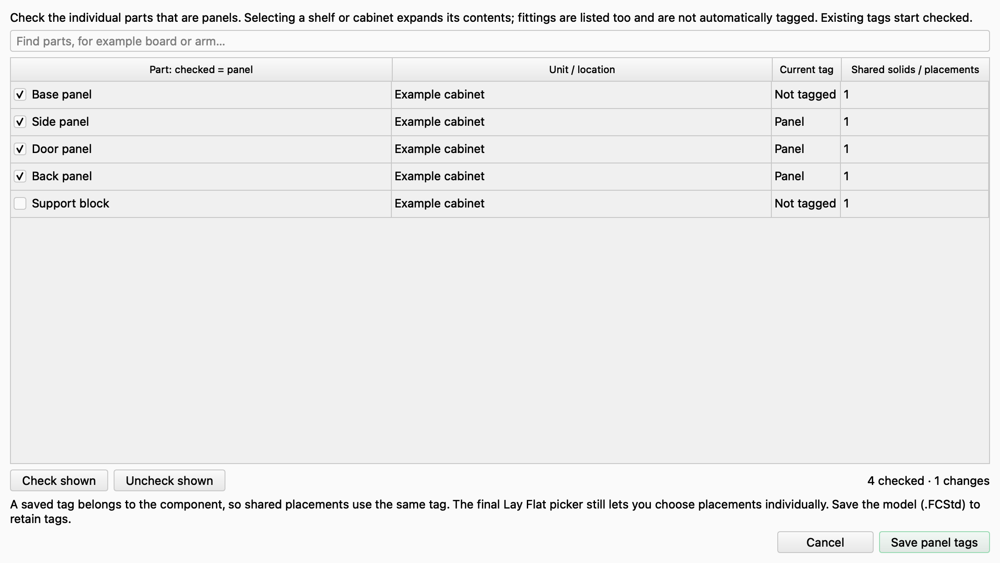
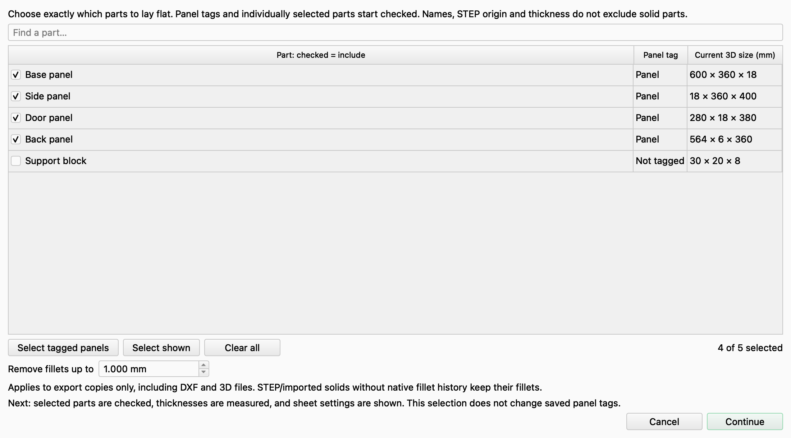
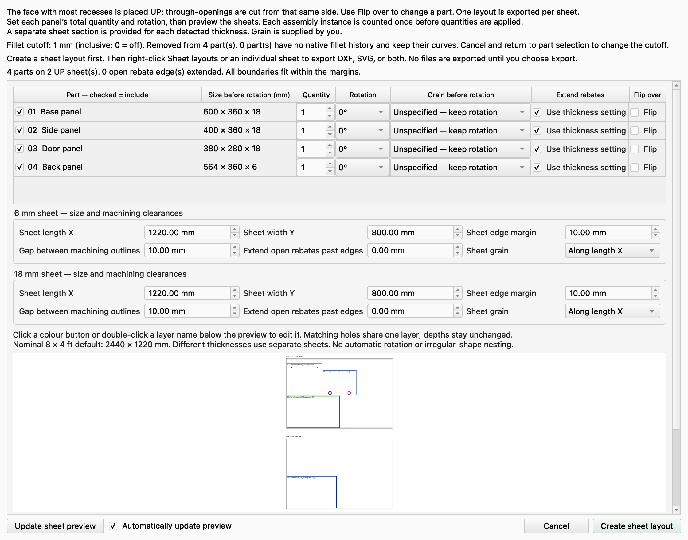
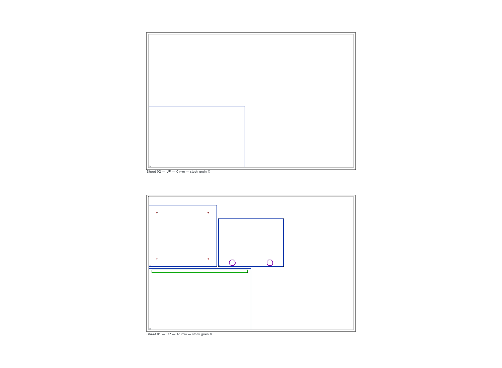
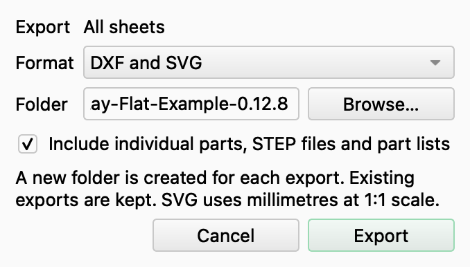
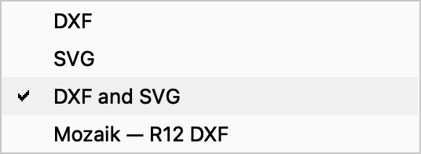
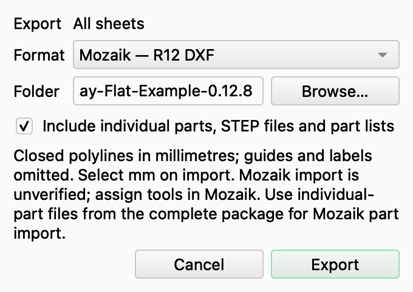

# Screenshot walkthrough

These are captures of the actual FreeCAD Lay Flat for CNC 0.12.8 interface on FreeCAD 1.1.3 for macOS. They use a small example cabinet with four panels and an unselected support block. The example sheet dimensions are not stock recommendations.

## 1. Optional panel tags

Check the components that are panels and leave fittings unchecked. **Save panel tags** remembers the choices in the model; save the `.FCStd` model to retain them between sessions.

## 2. Choose parts and the fillet cutoff

The part picker shows each component and its current size. Tags provide defaults; you can change the selection for this layout. **Remove fillets up to** defaults to 1 mm, including exactly 1 mm. Set it to 0 to keep all fillets.

## 3. Set up and preview the sheets

Set quantities, rotation, grain, machining clearances and sheet dimensions. Each thickness gets its own stock settings. The preview updates automatically, or you can use **Update sheet preview**. Click **Create sheet layout** when ready; this does not export files.

Operation colours and layer names can also be edited in the table below the preview; scroll down if it is below the visible area.

## 4. Inspect the layout

The generated FreeCAD document shows the arranged outlines and machining features. Colours distinguish operation layers. Different thicknesses stay on separate sheets.

## 5. Read the operation tree

Expand **Sheet layouts — operations**, then a sheet. Matching operations are combined into one item per sheet. Hole diameters and depths are written explicitly. The sheet number appears in brackets, rather than as an unexplained duplicate-label suffix.

**Guides — not cuts** keeps reference geometry separate. The 3D copies are in their own initially hidden group.

## 6. Export from the tree

Right-click **Sheet layouts — operations** for **Export all sheets…**. Right-click an individual sheet for **Export this sheet…**. The image shows the export action contributed by the macro; FreeCAD may also show its standard context-menu actions.

## 7. Choose the destination and package contents

Choose a format and an existing destination folder. For all sheets from a newly created layout, you can include the individual part drawings, STEP files and part lists. Each export creates a new folder and keeps previous exports.

## 8. Choose an export format

Standard DXF is R2004. SVG uses millimetres at 1:1 scale. **DXF and SVG** produces both. The separate Mozaik option writes R12 closed polylines.

## 9. Use the Mozaik preset

For Mozaik's part-import workflow, export all sheets with the complete package enabled and use the individual-part `_R12.dxf` files. Do not use the nested `Sheet_*` files as individual parts. Select millimetres on import and assign tools in Mozaik. Guides and labels are omitted from the R12 drawings.

An independent DXF reader checked the R12 structure and geometry. **Actual import into Mozaik remains unverified.**

After exporting, the completion message gives the saved folder and an **Open export folder** button. Save the FreeCAD sheet layout normally if you want to reopen it and export again later; the complete macro package must be installed for the right-click actions to restore.

[Return to the main README](../README.md)
